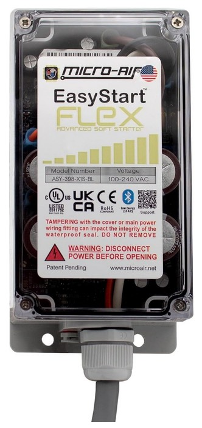
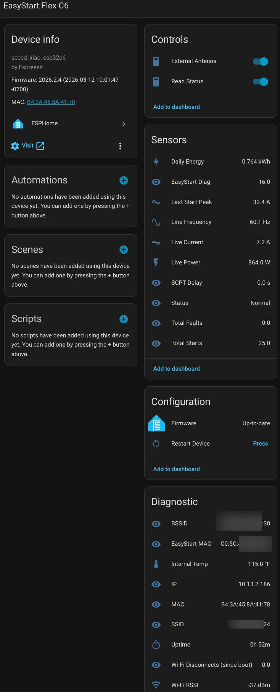

# Micro-Air EasyStart ESPHome Integration

Monitor your [Micro-Air EasyStart Flex](https://www.microair.net/products/easystart-flex-home-ac-soft-starter) air conditioner soft starter from Home Assistant using ESPHome and a Bluetooth-capable ESP32 device.



## Overview

The EasyStart Flex is a soft starter for single-phase AC compressors (RV A/C units, mini-splits, etc.) that reduces inrush current on startup. This integration connects to the EasyStart Flex over Bluetooth Low Energy (BLE) and exposes real-time operational data as sensors in Home Assistant.

The following data is read from the EasyStart BLE connection:

| Field | Description |
|-------|-------------|
| Energy (Daily) | Cumulative energy consumption today (kWh), resets at midnight |
| Energy (Total) | Lifetime cumulative energy consumption (kWh), never resets — use this for the HA Energy dashboard |
| Last Start Peak | Peak inrush current on last startup (A) |
| Line Frequency | AC line frequency (Hz) |
| Live Current | Real-time A/C current draw (A) |
| Live Power | Calculated power usage at 120V (W) |
| SCPT Delay | Short Cycle Protection Timer delay (s) |
| Status | Operational status string |
| Total Faults | Cumulative fault count |
| Total Starts | Cumulative compressor start count |

You can read my full blog post about the EasyStart ESPHome integration: 📖 [ESPHome: Micro-Air EasyStart Integration](https://www.derekseaman.com/2026/03/esphome-micro-air-easystart-integration.html)

## Physical Installation

Before configuring ESPHome, the EasyStart Flex must be physically installed on your A/C unit. The following video walks through the hardware installation process:

📺 [Micro-Air EasyStart Installation Video](https://www.youtube.com/watch?v=8jQtstNggrs&t=2s)

These are the tools and components that I used:
* 3/4" liquid tight connector https://www.amazon.com/dp/B0CN79R7LV?th=1
* 1-1/8" hole saw kit https://www.amazon.com/dp/B0CG93ZVF2?th=1
* IRWIN Wire stripper: https://www.amazon.com/dp/B000OQ21CA?th=1
* 6" Wire cutters: https://www.amazon.com/dp/B07C5PM8L4?th=1

> **Warning:** Always exactly follow the Micro-Air installation instructions. If you are not 100% sure what you are doing, contact an HVAC specialist for installation. Always remove the breaker before opening the access panels on your A/C. The following steps are my interpretation of the Micro-Air instructions which worked for me. If in any doubt, trust Micro-Air instructions or your local HVAC professional. Use at your own risk.

**High-level installation steps:**

1. Remove the A/C breaker and verify the A/C is de-energized.
2. Short the terminals on the capacitor to discharge it.
3. Decide where you want to mount your EasyStart. If needed, drill a hole and insert a grommet or liquid tight connector to protect the cable.
4. Connect the orange EasyStart wire to the HERM terminal on the capacitor.
5. Trace the Compressor wire (C) to the contactor block. Connect the EasyStart black wire to the same contactor block terminal as the C wire.
6. Locate the Run (R) wire from the compressor that connects to the contactor block. 4–6 inches from where it terminates on the contactor block, cut the wire.
7. Using the provided Wago connector, strip and connect the Run wire leading to the compressor to the EasyStart brown wire.
8. Using the provided Wago connector, strip and connect the Run wire leading to the contactor block to the EasyStart white wire.
9. Turn the breaker back on, and cycle your A/C six times to complete the learning process.

> **Note:** I strongly suggest ordering the "starter kit" version of the product ($10 more on Amazon) as it already has all the connectors you will likely need. The kit version is not shown in the above Youtube video link. So in most cases you will not need to purchase the crimping tools and connectors shown in the video.

## Requirements

- [ESPHome](https://esphome.io) 2025.12 or later
- An ESP32 board with Bluetooth support
- Micro-Air EasyStart Flex unit installed and powered
- ESP32 placed within reliable BLE range of the EasyStart Flex — range is extremely limited, recommend 3–6 feet (1–2 meters)
- Home Assistant with the ESPHome integration

## Files

| File | Description |
|------|-------------|
| `examples/Micro-Air EasyStart base.yaml` | Generic ESP32 base configuration |
| `examples/Micro-Air EasyStart Seeed Studio Xiao C3.yaml` | Seeed Studio XIAO ESP32-C3 — USB CDC UART, no LED, no RF switch |
| `examples/Micro-Air EasyStart Seeed Studio Xiao C5.yaml` | Seeed Studio XIAO ESP32-C5 — WiFi 6 dual-band (2.4 + 5 GHz), status LED GPIO27, 8MB flash |
| `examples/Micro-Air EasyStart Seeed Studio Xiao C6.yaml` | Seeed Studio XIAO ESP32-C6 — external antenna RF switch, status LED GPIO15 |
| `examples/Micro-Air EasyStart Seeed Studio Xiao S3.yaml` | Seeed Studio XIAO ESP32-S3 — status LED GPIO21, no RF switch |

Use the **base** file as a starting point for any BLE-capable ESP32 board. Use the board-specific file if you are deploying on a Seeed Studio XIAO variant.

## Board Configuration

Edit the `esp32_variant` and `esp32_board` substitutions at the top of your chosen YAML file to match your ESP32 device:

```yaml
substitutions:
    esp32_variant: esp32c6          # Change to match your chip variant
    esp32_board: seeed_xiao_esp32c6 # Change to match your specific board
```

> **Important:** Your board must have Bluetooth support. ESP32-S2 has no BLE and will not work with this integration.

**Example — Adafruit ESP32 Huzzah32 Feather:**
```yaml
    esp32_variant: esp32
    esp32_board: featheresp32
```

### Supported `esp32_variant` values (March 2026)

| Variant | Chip | BLE | Notes |
|---------|------|-----|-------|
| `esp32` | Original ESP32 | 4.2 | Most common, widely supported |
| `esp32s2` | ESP32-S2 | ❌ None | **Not compatible** — no Bluetooth |
| `esp32s3` | ESP32-S3 | 5.0 | Dual-core, good performance |
| `esp32c2` | ESP32-C2 | 5.0 | Low-cost RISC-V, limited RAM |
| `esp32c3` | ESP32-C3 | 5.0 | Popular low-cost RISC-V option |
| `esp32c5` | ESP32-C5 | 5.0 | Dual-core RISC-V, Wi-Fi 6 dual-band (2.4 + 5 GHz) |
| `esp32c6` | ESP32-C6 | 5.3 | Wi-Fi 6, used in base config |
| `esp32h2` | ESP32-H2 | 5.3 | No Wi-Fi — **not compatible** |

For a full list of supported board names, see the [ESPHome ESP32 platform documentation](https://esphome.io/components/esp32.html).

## Setup

### 1. Configure Secrets

Ensure your ESPHome `secrets.yaml` contains:

```yaml
wifi_ssid: "Your WiFi SSID"
wifi_password: "Your WiFi Password"
wifi_captive: "fallback-hotspot-password"
```

### 2. Set API and OTA Credentials

Edit the `substitutions:` block at the top of your chosen YAML file and fill in your API encryption key and OTA password. Leave the `easystart_mac` as the placeholder for now — you will discover it automatically in the next step.

```yaml
substitutions:
    device_name: easystart
    friendly_name: EasyStart
    easystart_mac: "AA:BB:CC:DD:EE:FF"  # Leave as placeholder for now
    api_key: "your-api-encryption-key"
    ota_password: "your-ota-password"
```

### 3. Flash, Discover MAC, and Update

1. **Flash** the configuration to your ESP32 via ESPHome and adopt the device in Home Assistant.
2. **Position** your ESP32 within a few feet of your EasyStart Flex and turn on your air conditioner.
3. **Do not** connect to the EasyStart using any Micro-Air mobile or desktop apps — only one BLE device can connect at a time.
4. **Wait** a minute or two for the **EasyStart MAC** diagnostic sensor to populate in the Home Assistant device page. This sensor automatically detects any nearby EasyStart unit by its BLE advertisement name.
5. **Copy** the discovered MAC address, update the `easystart_mac` substitution in your YAML, and reflash the ESP32. The device will now auto-connect to your EasyStart on boot.
6. **Power on** your air conditioner and verify that sensor data is populated.

> **Note:** The EasyStart only accepts BLE connections when the A/C is running. The **Read Status** switch will turn off when the A/C is off and there is no BLE connection. It should auto-reconnect when the A/C turns on and the EasyStart begins broadcasting.

## Home Assistant Entities

Once running, the following entities will be available in Home Assistant:

### Sensors
| Entity | Description |
|--------|-------------|
| Live Current | Real-time A/C current draw (A) |
| Live Power | Calculated power usage at 120V (W) |
| Energy (Daily) | Cumulative energy consumption today (kWh), resets at midnight |
| Energy (Total) | Lifetime cumulative energy consumption (kWh), never resets — use this for the HA Energy dashboard |
| Line Frequency | AC line frequency (Hz) |
| Last Start Peak | Peak inrush current on last startup (A) |
| SCPT Delay | Short Cycle Protection Timer delay (s) |
| Total Faults | Cumulative fault count |
| Total Starts | Cumulative compressor start count |
| Status | Current operational status (Normal or fault description) |

### Diagnostic Sensors
| Entity | Description |
|--------|-------------|
| Internal Temp | ESP32 internal temperature |
| Uptime | Device uptime in hours |
| Wi-Fi RSSI | Wi-Fi signal strength |
| Wi-Fi Disconnects (since boot) | Number of Wi-Fi drops since last reboot |
| EasyStart MAC | Auto-detected BLE MAC address of the nearest EasyStart unit |
| IP / MAC / SSID / BSSID | Network info |

### Controls
| Entity | Description |
|--------|-------------|
| Read Status (switch) | Turn ON to begin polling the EasyStart every 10 seconds; turn OFF to stop. Automatically activates on BLE connect and deactivates on disconnect. |
| Restart Device (button) | Reboots the ESP32 |

## Status Values

The **Status** sensor reports one of the following:

| Value | Meaning |
|-------|---------|
| Normal | Unit operating correctly |
| Unexpected Curr Flt | Unexpected current fault |
| Short Cycle Delay | Short cycle protection active |
| Pwr Intrrptn Fault | Power interruption fault |
| Stall Fault | Motor stall detected |
| Stuck SR Fault | Stuck start relay fault |
| Open Ovrld Fault | Open overload fault |
| Overcurrent Fault | Overcurrent detected |
| Bad Wiring Fault | Wiring issue detected |
| Wrong Voltage Flt | Incorrect line voltage |



## Troubleshooting

### Sensors no longer updating

During testing I noticed that the EasyStart changed its broadcasting BLE MAC address after a few hours. If your sensors are no longer automatically updating when the air conditioner is on, verify the **EasyStart MAC** address in the Diagnostic section of the Home Assistant device page matches the value in your YAML.

## Notes

- The ESP32 uses `auto_connect: true` to maintain a persistent BLE connection to the EasyStart. The **Read Status** switch activates automatically on BLE connect and deactivates on disconnect. Live Current and Live Power are zeroed out when the BLE connection drops.
- The **EasyStart MAC** diagnostic sensor scans for nearby EasyStart units by their BLE advertisement name, allowing you to discover the MAC address without a phone app.
- Live Power is calculated as `Live Current × 120V`. If you are on a 240V system, adjust the multiplier in the YAML.
- The EasyStart BLE service UUID is `d973f2e0-b19e-11e2-9e96-0800200c9a66`.
- Some ESP32 devices have very limited memory, so enabling additional BLE functions like BLE proxy may cause the ESP32 to crash. I suggest dedicating an ESP32 for EasyStart to ensure reliability.

## Acknowledgements

The EasyStart BLE characteristic decoding — including the service UUID, data byte layout, and sensor calculations — is based on the original work by [Keen-coffee](https://github.com/Keen-coffee/home_assistant/blob/main/easyStart). This integration builds upon that foundation to deliver a polished ESPHome/Home Assistant experience.

## License

This project is licensed under the [MIT License](LICENSE).
